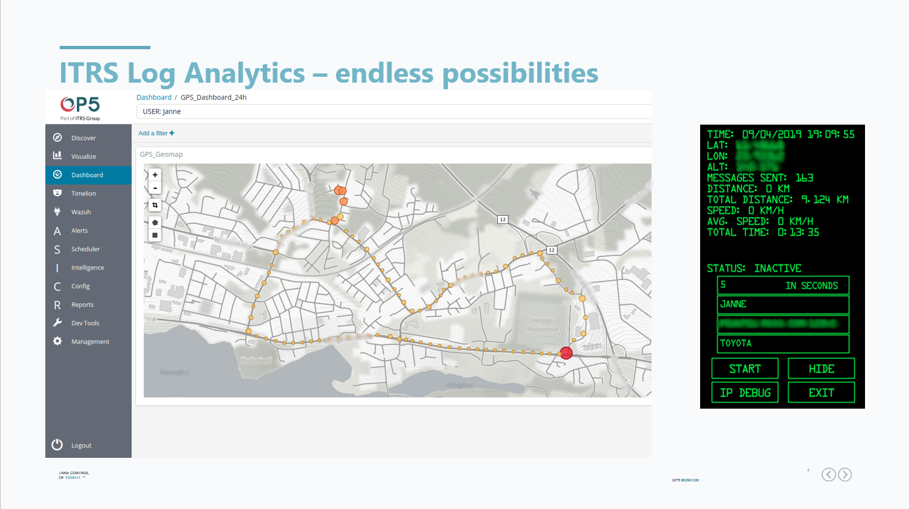

# Coordinates
[WIP] Coordinates application

This application tracks your location, and can be used to push a message to a set IP address. You can set an interval, a user and a comment to track your sessions.

The application also displays your location, distance and speed from last point, total time, distance and average speed since the session started.

This can be used in co-operation with Elastic (Elasticsearch, Logstash, Kibana). Application sends messages with specified interval to Logstash node, which parses the information and sends that to Elastic 7.x to be indexed. Once indexed you can check your route, investigate speed and other metrics on a map. This can be used to track traffic congestions etc.

